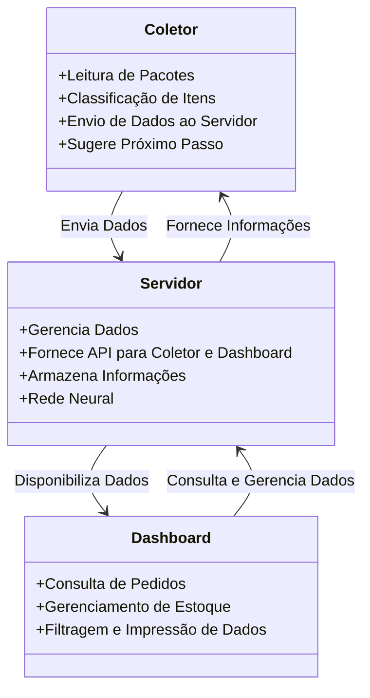

# 📦 Sistema de Gestão Logística Automatizado – WireFrame

## 🚀 Visão Geral
Este repositório contém a documentação e estrutura do **Sistema de Gestão Logística** desenvolvido para uma empresa ficiticia para atividade de **Levantamento de Requisitos**.  

O objetivo do sistema é otimizar processos logísticos através da digitalização, automação e rastreamento eficiente de pacotes para uma empresa ficticia, onde através de uma interface eficiente e um Back-End robusto conseguimos treinar um motor de inferência ao longo do tempo.

## 🎯 Propósito do Sistema
- Reduzir erros operacionais na classificação e movimentação de produtos.
- Melhorar a rastreabilidade através de um sistema integrado de **Coletor, Dashboard e Servidor**.
- Implementar um **fluxo FIFO** (First In, First Out) inteligente para garantir a rotatividade correta dos produtos.
- Digitalizar processos, reduzindo o uso de papel e aumentando a eficiência operacional.
- Otimizar a escalabilidade do banco de dados, permitindo a gestão eficiente de milhões de pacotes diários.
- Através de um motor de inferência leve para Machine Learning automatizar o redirecionamento do pacotes sendo rodado no lado servidor.

---

## 🏗️ Estrutura do Sistema
O sistema é dividido em **três módulos principais**, que trabalham juntos para otimizar a logística da empresa:

1. **📲 Coletor** – Dispositivo móvel que realiza a **leitura e classificação de pacotes**.  
2. **📊 Dashboard** – Interface administrativa para **monitoramento e controle dos pedidos**.  
3. **🖥️ Servidor** – Responsável pelo **gerenciamento de dados, API, automação e armazenamento**.  

---

## 📡 Arquitetura do Sistema



---

## 📂 Estrutura do Repositório

```
📦 projeto-logistica
├── 📜 README.md  # Documento principal
├── 📂 coletor    # Documentação e código do Coletor
├── 📂 dashboard  # Documentação e código do Dashboard
├── 📂 servidor   # Documentação e código do Servidor
```

---

## 📜 Licença
Este projeto está licenciado sob a **MIT License** – consulte o arquivo `LICENSE` para mais detalhes.

---

## 📬 Contato
Caso queira entrar em contato conosco, segue nossos LinkedIn:

- **[Pedro](https://www.linkedin.com/in/seu-perfil/)** 
- **[Luana]()**
- **[Rebeca]()** 
- **[Milla]()**
