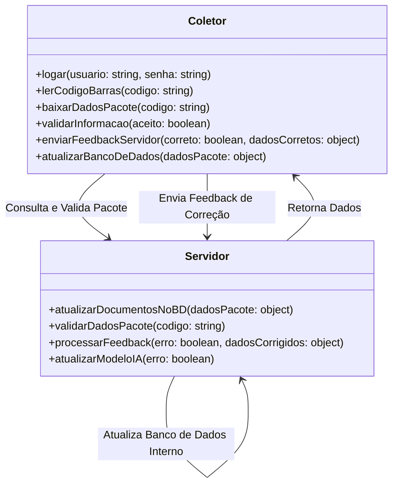

# [📲 Módulo Coletor – Sistema de Gestão Logística](https://wireframe.cc/pro/pp/087e9bb82863921)

## 🚀 Visão Geral
O **Módulo Coletor** é responsável por capturar as informações dos pacotes por meio da **leitura de código de barras** e comunicar-se com o **servidor** para validação e aprendizado contínuo.

Ele exibe os detalhes do pacote **assim que o código de barras é lido**, permitindo que o usuário confirme ou corrija as informações antes de atualizar o banco de dados.

## 📜 Fluxo de Operação

1️⃣ **Login**  
   - O usuário faz login via **crachá ou senha**.  
   - Após autenticação, é redirecionado para a tela principal.

2️⃣ **Leitura de Código de Barras**  
   - O usuário escaneia o **código de barras do pacote**.  
   - O **servidor retorna as informações do pacote** com base no banco de dados.  

3️⃣ **Confirmação pelo Usuário**  
   - O usuário **valida se os dados estão corretos**.  
   - Se **confirmar**, o sistema **premia a IA do servidor**.  
   - Se **corrigir**, a **IA ajusta automaticamente os pesos de inferência**.

4️⃣ **Atualização no Servidor**  
   - Os dados são **atualizados no banco de dados**.  
   - A nova informação é registrada para **melhorar a precisão futura do motor de inferência**.

---

## ⚙️ Métodos e Funcionalidades

### 📌 **Explicação dos Métodos**
#### **No Coletor:**
- `logar(usuario, senha)`: Autentica o usuário e redireciona para a tela principal.
- `lerCodigoBarras(codigo)`: Captura o código de barras e aciona o servidor.
- `baixarDadosPacote(codigo)`: Obtém do servidor as informações associadas ao código lido.
- `validarInformacao(aceito)`: O usuário confirma se as informações estão corretas.
- `enviarFeedbackServidor(correto, dadosCorretos)`: Envia ao servidor se os dados estavam corretos ou se houve correção manual.
- `atualizarBancoDeDados(dadosPacote)`: Se houve correção, envia os dados revisados para o banco.

#### **No Servidor (Interação com a IA):**
- `validarDadosPacote(codigo)`: Verifica se o código de barras já existe no banco.
- `processarFeedback(erro, dadosCorrigidos)`: Caso tenha erro, ajusta as informações e atualiza os registros.
- `atualizarModeloIA(erro)`: Se um erro for identificado, a IA **ajusta seu aprendizado para evitar falhas futuras**.
- `atualizarDocumentosNoBD(dadosPacote: object)`: Atualiza documento para representação no DashBoard.

---

## 🎯 Benefícios da Automação no Coletor
✅ **Redução de erros** – A IA aprende com os feedbacks e melhora as previsões futuras.  
✅ **Velocidade no processo** – O coletor baixa os dados do servidor instantaneamente.  
✅ **Interação inteligente** – A cada erro corrigido, o motor de inferência se ajusta.  
✅ **Melhor rastreabilidade** – Todos os dados são armazenados e atualizados em tempo real.  