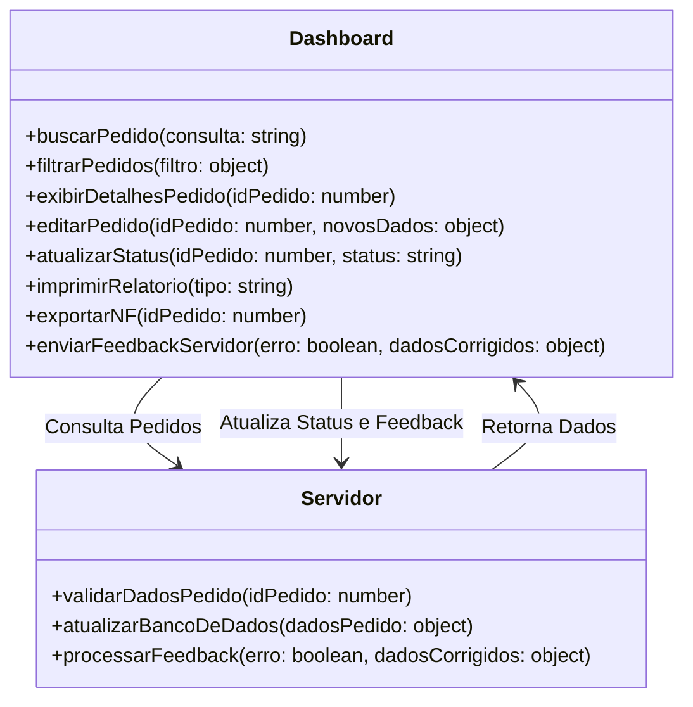

# [📊 Módulo Dashboard – Sistema de Gestão Logística](https://wireframe.cc/pro/pp/5ac75052e862047)

## 🚀 Visão Geral
O **Módulo Dashboard** é a interface administrativa do sistema, utilizada para **monitorar, classificar e gerenciar pedidos além de fornecer um chat para uma LLM que carrega os dados treinados através de embenddings** em tempo real.  

O dashboard fornece uma **visão geral da logística**, permitindo consultas rápidas, organização eficiente de pacotes e controle sobre o fluxo de entrada, processamento e saída.

---

## 📜 Fluxo de Operação

1️⃣ **Acesso ao Sistema**
   - O usuário faz login no **Dashboard** utilizando credenciais registradas.
   - O sistema carrega os **pedidos ativos e pendentes**.

2️⃣ **Consulta e Filtragem**
   - O usuário pode buscar pedidos por **código, fornecedor, status, setor ou tipo de produto**.
   - O dashboard exibe as **informações do pacote**, como **responsável, data, setor, tipo e características**.

3️⃣ **Classificação e Edição**
   - O usuário pode definir o status do pedido:
     - **Entrada** → Pacote recém-recebido.
     - **Em Processamento** → Pacote em movimentação.
     - **Saída** → Pacote liberado para expedição.
     - **Revisão** → Pacote com informações inconsistentes.
   - Se necessário, pode **corrigir informações e atualizar o banco de dados**.

4️⃣ **Impressão e Exportação**
   - O dashboard permite **exportar NFs e documentos em PDF**.
   - Impressão reduzida para **diminuir o uso de papel**.

5️⃣ **Feedback para o Servidor**
   - Caso o operador corrija um erro, a **IA no servidor é atualizada**, melhorando futuras previsões de destino dos pacotes.

---

## ⚙️ Métodos e Funcionalidades

### 📌 **Explicação dos Métodos**
#### **No Dashboard:**
- `buscarPedido(consulta)`: Realiza buscas por pedidos específicos.
- `filtrarPedidos(filtro)`: Permite filtragem por status, setor, data, etc.
- `exibirDetalhesPedido(idPedido)`: Exibe detalhes completos de um pedido selecionado.
- `editarPedido(idPedido, novosDados)`: Permite edição manual dos dados do pedido.
- `atualizarStatus(idPedido, status)`: Atualiza o status do pacote (Entrada, Processamento, Saída, Revisão).
- `imprimirRelatorio(tipo)`: Gera relatórios com base nas movimentações dos pacotes.
- `exportarNF(idPedido)`: Exporta a Nota Fiscal em PDF.
- `enviarFeedbackServidor(erro, dadosCorrigidos)`: Caso uma previsão da IA esteja errada, envia feedback para **corrigir o aprendizado**.

#### **No Servidor (Interação com o Dashboard):**
- `validarDadosPedido(idPedido)`: Verifica se os dados do pedido estão corretos.
- `atualizarBancoDeDados(dadosPedido)`: Atualiza os registros com as informações do Dashboard.
- `processarFeedback(erro, dadosCorrigidos)`: Se houver erro, ajusta as informações e melhora a inferência.

---

## 🎯 Benefícios da Automação no Dashboard
✅ **Organização eficiente** – Classificação de pedidos otimizada.  
✅ **Velocidade na busca e filtragem** – Redução do tempo de processamento.  
✅ **Menos erros** – Feedback contínuo melhora a inferência da IA.  
✅ **Sustentabilidade** – Redução do uso de papel por meio de exportação digital.  