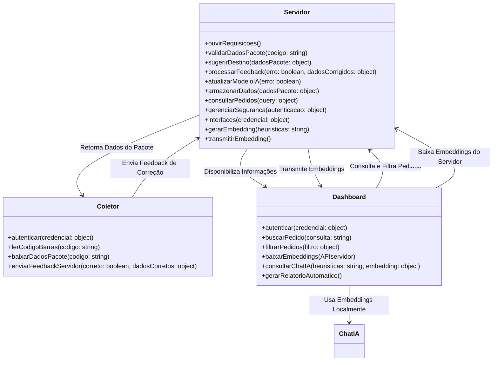
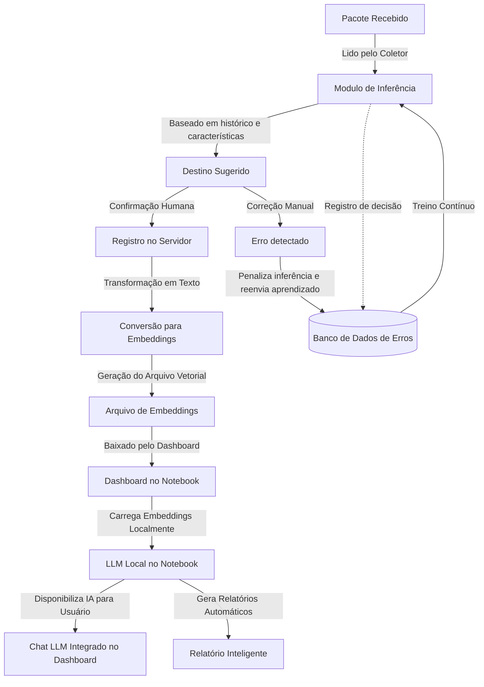

# 🖥️ Módulo Servidor – Sistema de Gestão Logística

## 🚀 Visão Geral
O **Módulo Servidor** é o **núcleo da operação logística**, responsável por **processar, armazenar e fornecer dados** para o **Coletor** e **Dashboard**.  

Ele gerencia as solicitações, valida informações dos pacotes, controla permissões e **mantém a IA treinada com feedbacks dos usuários**.

---

## 📜 Fluxo de Operação

1️⃣ **Recebimento de Requisições**
   - O servidor escuta **solicitações do Coletor e Dashboard**.
   - Verifica permissões e autenticação antes de processar os dados.

2️⃣ **Validação de Dados**
   - Quando um código de barras é lido pelo Coletor, o servidor verifica se **os dados do pacote já existem no banco**.
   - Caso contrário, **gera um novo registro e sugere um setor de destino**.
   - Caso seja o ultimo, **define um TTL** para correções.

3️⃣ **Inferência e Aprendizado da IA**
   - O sistema sugere um destino para o pacote com base em **dados históricos e regras logísticas**.
   - Caso o usuário corrija a inferência, o servidor **ajusta automaticamente o modelo de IA**.

4️⃣ **Atualização do Banco de Dados**
   - Após a confirmação ou correção, os dados são **salvos no banco NoSQL**.
   - O **ciclo de vida do pacote** é gerenciado para evitar sobrecarga.

5️⃣ **Fornecimento de Dados ao Dashboard**
   - O servidor atende às solicitações do Dashboard para consultas, filtros e impressão de NFs.
   - A LLM integrada no chat do Dashboard **consulta dados relevantes** e responde perguntas sobre pedidos e estoque.

---

## ⚙️ Métodos e Funcionalidades
### Geral

#### Por que rodar o LLM localmente?
✅ Rodar a LLM localmente no notebook reduz carga no servidor.
✅ Transpilação vetorial é mais leve, pois apenas gera representações compactadas dos dados e não requer inferência pesada no servidor.
✅ Notebook pode operar offline, usando os embeddings baixados para consultas rápidas.
**Traduzindo**
✅ Menos carga no servidor → Apenas processa embeddings e os transmite.
✅ Dashboard pode funcionar offline → LLM usa os embeddings locais.
✅ Baixa latência → Usuário acessa informações rapidamente sem depender de rede.
✅ Treinamento dinâmico → O servidor ajusta embeddings ao longo do tempo, permitindo aprendizado incremental.
### Metodo de Treinamento

#### Por que não rodar a IA no lado servidor?
✅ Maior desempenho: O servidor apenas processa embeddings, sem rodar inferência direta na LLM.
✅ Redução de Latência: Dashboard carrega os embeddings uma única vez, sem necessidade de acessar o servidor continuamente.
✅ Modo Offline: A LLM roda mesmo sem conexão com o servidor.
✅ Relatórios Inteligentes: A IA pode resumir e gerar relatórios baseados nos dados recebidos.
---

Função matemática em diagrama:
```
graph TD;

    %% Entrada dos Dados
    Input["📥 Entrada: Heurísticas (Palavras)"] -->|Convertido em Vetores| Embeddings["🧠 Representação Vetorial"]
    
    %% Inferência Inicial
    Embeddings -->|Multiplicação por Pesos| Inferencia["⚙️ Cálculo da Inferência: S(t) = Σ w_i f(x_i)"]
    
    %% Feedback e Ajuste
    Inferencia -->|Comparação com o Valor Real| Erro["❌ Cálculo do Erro: e = S(t) - y_real"]
    Erro -->|Atualização de Pesos| AjustePesos["🔄 Ajuste dos Pesos: w_i = w_i - η * e * f(x)"]
    
    %% Loop de Aprendizado
    AjustePesos -->|Recalcula Inferência| Inferencia
    Inferencia -->|Melhora a Precisão ao Longo do Tempo| Resultado["✅ Inferência Otimizada"]
```

Já comecei, pq não?

```C
#include <stdio.h>
#include <math.h>

#define N 10  // Número de heurísticas (neurônios simbólicos)
#define EPOCHS 50  // Número de iterações
#define ETA 0.1  // Taxa de aprendizado

// Função de ativação tangente hiperbólica
double activation(double x) {
    return tanh(x);
}

int main() {
    double weights[N]; // Pesos das conexões entre heurísticas
    double heuristics[N]; // Representação vetorial das heurísticas
    double S_t; // Estado da inferência
    double y_real; // Valor correto esperado
    double error;

    // Inicializando pesos e heurísticas
    for (int i = 0; i < N; i++) {
        weights[i] = (double) rand() / RAND_MAX; // Pesos aleatórios entre 0 e 1
        heuristics[i] = ((double)i / N) * 2 - 1; // Valores entre -1 e 1
    }

    // Treinamento
    for (int epoch = 0; epoch < EPOCHS; epoch++) {
        S_t = 0;
        
        // Calcula a inferência
        for (int i = 0; i < N; i++) {
            S_t += weights[i] * activation(heuristics[i]);
        }

        // Define um valor correto simulado (média das ativações)
        y_real = 0;
        for (int i = 0; i < N; i++) {
            y_real += activation(heuristics[i]);
        }
        y_real /= N;

        // Calcula erro
        error = S_t - y_real;

        // Ajuste dos pesos
        for (int i = 0; i < N; i++) {
            weights[i] -= ETA * error * activation(heuristics[i]);
        }

        // Print da inferência para visualização do aprendizado
        printf("Iteração %d: S_t = %.6f, Erro = %.6f\n", epoch, S_t, error);
    }

    printf("Treinamento finalizado.\n");
    return 0;
}
```

## 🎯 Benefícios da Automação no Servidor
✅ **Inferência inteligente** – O servidor **aprende com os erros** e ajusta o destino automaticamente.  
✅ **Redução de carga no banco** – Implementação de **ciclo de vida dos pacotes** para escalabilidade.  
✅ **Interação com IA** – O chat do Dashboard **consulta o servidor** para fornecer respostas baseadas nos dados através de embeddings e vetores.  
✅ **Segurança e Controle** – O sistema **valida permissões** antes de processar requisições.  
