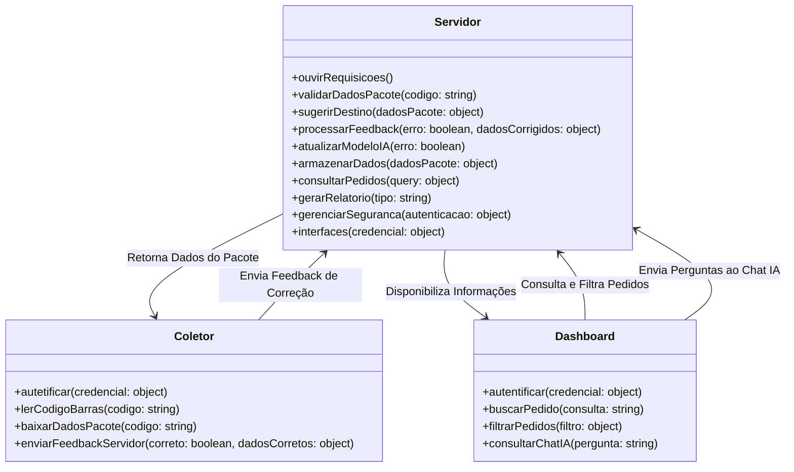
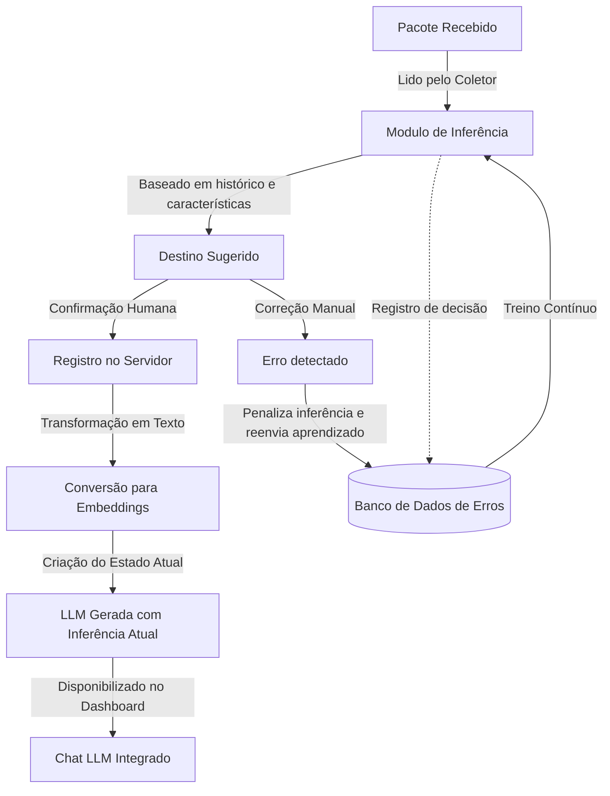

# 🖥️ Módulo Servidor – Sistema de Gestão Logística

## 🚀 Visão Geral
O **Módulo Servidor** é o **núcleo da operação logística**, responsável por **processar, armazenar e fornecer dados** para o **Coletor** e **Dashboard**.  

Ele gerencia as solicitações, valida informações dos pacotes, controla permissões e **mantém a IA treinada com feedbacks dos usuários**.

---

## 📜 Fluxo de Operação

1️⃣ **Recebimento de Requisições**
   - O servidor escuta **solicitações do Coletor e Dashboard**.
   - Verifica permissões e autenticação antes de processar os dados.

2️⃣ **Validação de Dados**
   - Quando um código de barras é lido pelo Coletor, o servidor verifica se **os dados do pacote já existem no banco**.
   - Caso contrário, **gera um novo registro e sugere um setor de destino**.
   - Caso seja o ultimo, **define um TTL** para correções.

3️⃣ **Inferência e Aprendizado da IA**
   - O sistema sugere um destino para o pacote com base em **dados históricos e regras logísticas**.
   - Caso o usuário corrija a inferência, o servidor **ajusta automaticamente o modelo de IA**.

4️⃣ **Atualização do Banco de Dados**
   - Após a confirmação ou correção, os dados são **salvos no banco NoSQL**.
   - O **ciclo de vida do pacote** é gerenciado para evitar sobrecarga.

5️⃣ **Fornecimento de Dados ao Dashboard**
   - O servidor atende às solicitações do Dashboard para consultas, filtros e impressão de NFs.
   - A LLM integrada no chat do Dashboard **consulta dados relevantes** e responde perguntas sobre pedidos e estoque.

---

## ⚙️ Métodos e Funcionalidades
### Geral

### Metodo de Treinamento

---

## 🎯 Benefícios da Automação no Servidor
✅ **Inferência inteligente** – O servidor **aprende com os erros** e ajusta o destino automaticamente.  
✅ **Redução de carga no banco** – Implementação de **ciclo de vida dos pacotes** para escalabilidade.  
✅ **Interação com IA** – O chat do Dashboard **consulta o servidor** para fornecer respostas baseadas nos dados através de embeddings e vetores.  
✅ **Segurança e Controle** – O sistema **valida permissões** antes de processar requisições.  
